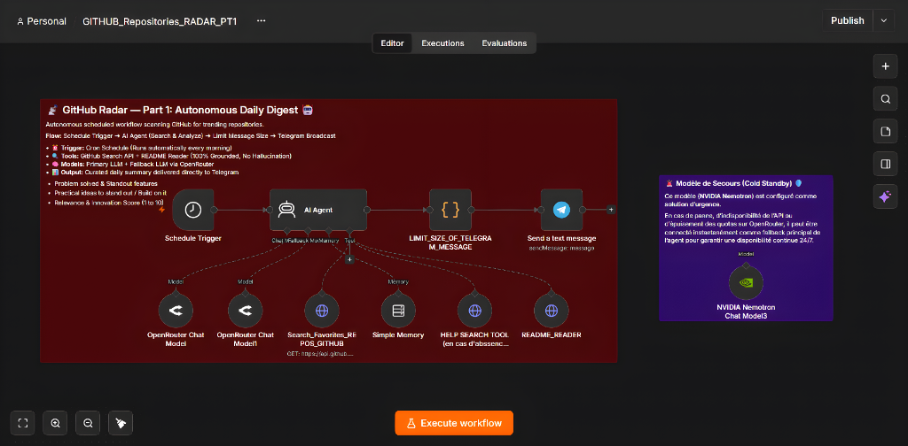

# 🔭 GitHub Radar — Part 1: Autonomous Daily Digest 🤖

[](https://n8n.io/)
[](https://telegram.org/)
[](https://langchain.com/)
[](https://docs.github.com/en/rest)
[](README.md)
[](LICENSE)

> 📡 **An autonomous, scheduled n8n workflow that scans GitHub daily for trending, high-impact repositories (50,000+ stars) in AI, autonomous agents, and workflow automation. It reads real READMEs without hallucination and delivers structured Arabic intelligence reports directly to your Telegram.**

> 🌍 **Language Scope (نطاق اللغة):**  
> This system is engineered and optimized **exclusively for the Arabic language** (يدعم اللغة العربية فقط). All daily briefs, technical synthesis, evaluation criteria, and Telegram outputs are generated strictly in Arabic.

👨‍💻 **Built with ❤️ by M.I.R.**

---

## 📸 Workflow Architecture

### 🛠️ Complete n8n Automated Pipeline (Part 1)
Automated cron schedule trigger, multi-LLM orchestrator with automatic fallback, context memory buffer, GitHub Search API, authentic README reader tool, Telegram message size limiter, and emergency cold standby model:

<p align="center">
  <a href="assets/n8n_part1_workflow_canvas.png">
    
  </a>
</p>

---

## 🧭 The Two-Part Ecosystem & Architectural Separation

This repository is **Part 1** of the **GitHub Radar** system. The complete system consists of two complementary workflows:

| Module | Primary Trigger | Core Purpose | Repository Link |
| :--- | :--- | :--- | :--- |
| **Part 1 (This Repository)** | `Schedule Trigger` (Cron) | **Autonomous Daily Digest:** Runs automatically on schedule, scans trending repos (50K+ stars), reads real documentation, and broadcasts curated briefs. | [github-repositories-radar-PT1 (Part 1)](https://github.com/Ilyeess-Rj/github-repositories-radar-PT1) |
| **Part 2** | `Telegram Trigger` (Webhook) | **Interactive On-Demand Assistant:** Answers real-time user questions about any repository with Arabic voice narration (ElevenLabs), text analysis, and diagrams. | [github-repositories-radar_PT2 (Part 2)](https://github.com/Ilyeess-Rj/github-repositories-radar_PT2) |

### ⚠️ Why are Part 1 & Part 2 Split into Separate Workflows?
> **Key n8n Architectural Constraint:**  
> In n8n, a single workflow **cannot support two active, independent trigger nodes** simultaneously without causing execution conflicts, event listener collisions, and webhook routing issues.
> 
> * **Part 1** must be driven by a **Schedule Trigger** (runs periodically on a clock).
> * **Part 2** must be driven by an event-based **Telegram Trigger** (wakes up when a user sends a chat message).
>
> Because n8n requires each automated flow to possess an unambiguous lifecycle entry point, we cleanly decoupled the radar into **two modular workflows**. You import and run each workflow independently in your n8n instance for maximum stability and zero trigger interference.

---

## 🎯 What Part 1 Does

1. ⏰ **Zero-Touch Scheduled Execution:** Runs automatically every morning (customizable cron interval).
2. 🔍 **Targeted GitHub Radar (50K+ Stars Only):** Focuses strictly on high-authority repositories in:
   - **Automation:** n8n, low-code/no-code AI workflow automation.
   - **AI Agents:** Agentic frameworks, autonomous multi-agent swarms.
   - **AI Models:** Open-source LLM releases and fine-tunes.
   - **Free/Low-Cost AI Tokens & APIs:** Free-tier inference providers.
   - **Cutting-Edge Frameworks:** RAG, MCP (Model Context Protocol), tool-use libraries.
3. 📖 **Mandatory Grounding (Zero Hallucination):** The AI Agent is strictly required to call `README_READER` via the GitHub API before generating any analysis. It is forbidden from guessing features.
4. 📝 **Structured Telegram Report:**
   - Exact repository URL.
   - Core concept & problem solved.
   - Architecture & main tech stack.
   - Standout features.
   - **Concrete exploitation ideas:** 2–3 actionable ideas on how the reader can integrate or leverage the repo (e.g. building an agent, integrating into n8n, free API replacement).
   - Interest Score (1 to 10).
5. 🛡️ **Telegram Message Size Limiter:** A built-in code node splits long multi-repository briefings into safe paragraph chunks (under 4,000 characters) to prevent Telegram API parsing rejections.
6. 🚨 **Emergency Cold Standby Model (NVIDIA Nemotron):** An isolated backup model node ready to be plugged in if OpenRouter limits are reached.

---

## 🛠️ Node Inventory

| Node | Type | Purpose |
| :--- | :--- | :--- |
| **Schedule Trigger** | `scheduleTrigger` | Triggers the daily morning scan automatically |
| **AI Agent** | `agent` | LangChain reasoning agent orchestrating search and analysis |
| **OpenRouter Chat Model** | `lmChatOpenRouter` | Primary LLM engine |
| **OpenRouter Chat Model1** | `lmChatOpenRouter` | Automatic fallback LLM engine |
| **NVIDIA Nemotron Chat Model3** | `lmChatNvidia` | Emergency cold standby model |
| **Search_Favorites_REPOS_GITHUB** | `httpRequestTool` | Queries GitHub Search API with keyword and star filters |
| **README_READER** | `httpRequestTool` | Fetches authentic README documentation via GitHub REST API |
| **HELP SEARCH TOOL** | `httpRequestTool` | Detailed metadata fetcher for edge cases |
| **Simple Memory** | `memoryBufferWindow` | Context buffer (100 messages) |
| **LIMIT_SIZE_OF_TELEGRAM_MESSAGE** | `code` | Formats safe HTML and chunks long text safely |
| **Send a text message** | `telegram` | Broadcasts the final daily brief to your Telegram chat |

---

## ⚙️ Quick Start & Setup

### 1. Prerequisites
- Running [n8n](https://n8n.io/) instance (Docker or Cloud).
- Telegram Bot Token from [@BotFather](https://t.me/BotFather).
- Your Telegram personal chat ID (or channel/group ID).
- GitHub Personal Access Token (PAT).
- OpenRouter API Key.

### 2. Import Workflow
1. In n8n, navigate to **Workflows → Import from File**.
2. Select **`GITHUB_RADAR_PT1_clean.json`**.

### 3. Connect Credentials
Open each node requiring credentials and select/create your accounts:
- `telegramApi` on **Send a text message**.
- `githubApi` on **README_READER** and search tools.
- `openRouterApi` on **OpenRouter Chat Model** nodes.

### 4. Configure Your Chat ID
In the **Send a text message** node:
- Replace `YOUR_TELEGRAM_CHAT_ID` with your numeric Telegram chat ID.

### 5. Activate
Toggle the workflow to **Active**. The radar will now run automatically on schedule!

---

## 📁 Repository Structure

```text
github-repositories-radar-part1/
├── assets/
│   └── n8n_part1_workflow_canvas.png # Screenshot of the n8n Part 1 workflow canvas
├── GITHUB_RADAR_PT1_clean.json       # Sanitized n8n workflow for Part 1
├── .env.example                     # Environment credentials template
├── .gitignore                       # Protection against accidental secret leaks
├── LICENSE                          # Apache 2.0 open-source license
└── README.md                        # Documentation & architectural guide
```

---

## 📜 License

This project is open-source software licensed under the **Apache License 2.0**.  
See the [LICENSE](LICENSE) file for complete details.

---

<p align="center">
  <b>Built by M.I.R</b> — Autonomous AI solutions for developers and tech enthusiasts.
</p>
